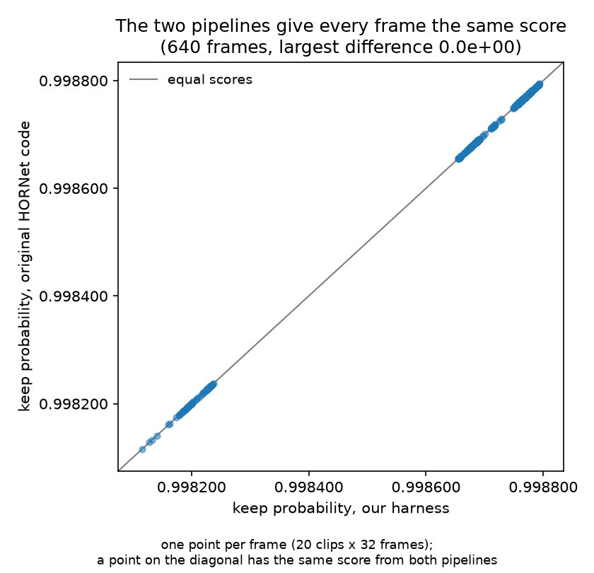
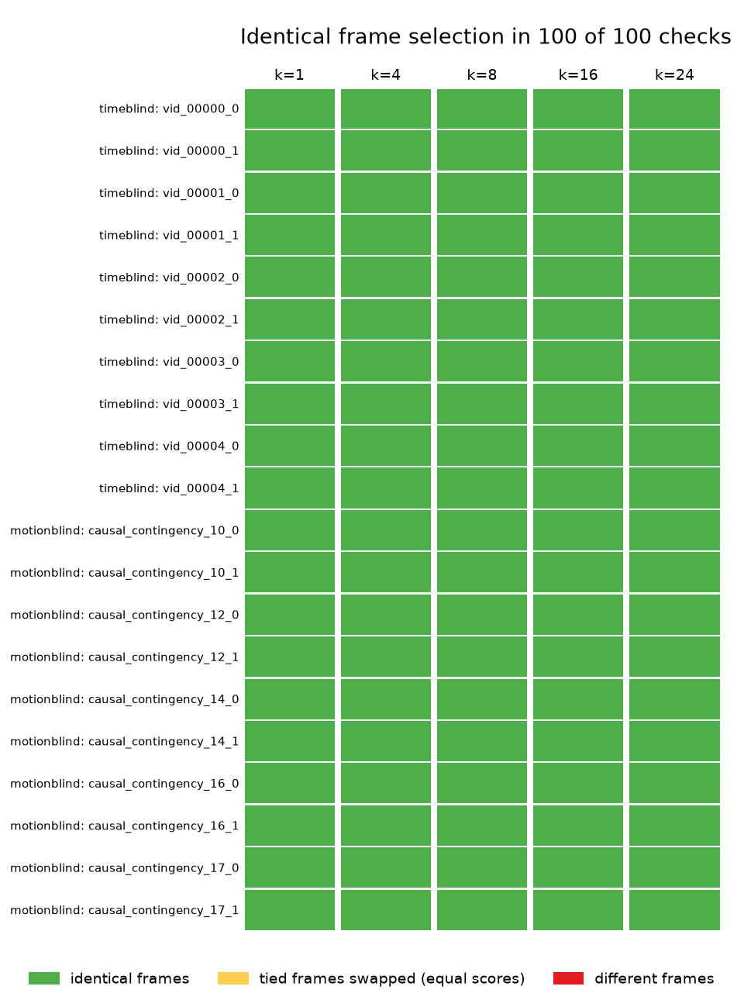
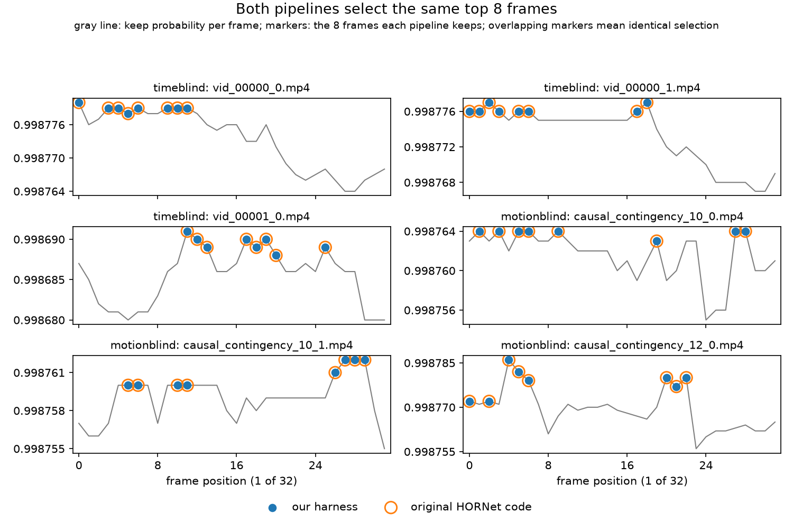
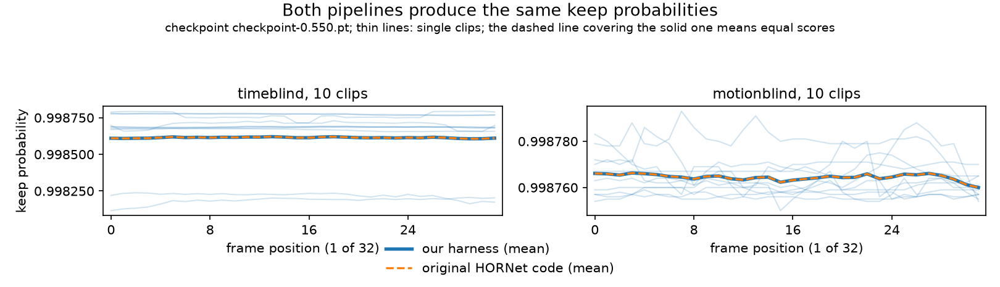
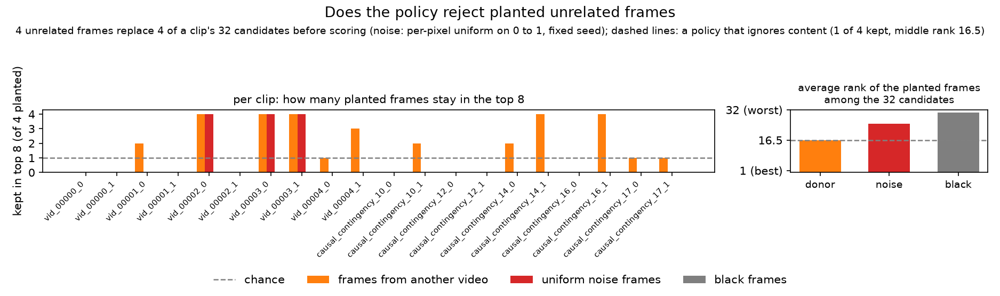

# HORNet selection verification

This page shows that the harness runs the authors' HORNet frame selector correctly. The
verification makes three claims. Each claim has one piece of evidence. All evidence
regenerates from `results/hornet_parity.json` with one command (see the last section).

## Claim 1: the harness runs the authors' code, unmodified

The `HORNet/` directory is a clone of the authors' repository at the upstream head
commit. The selection files are byte-identical on the development machine and on the
cluster that produced the results.

| Check | Value |
|---|---|
| upstream repository | `https://github.com/ostadabbas/HORNet.git` |
| commit (equals upstream `origin/main`) | `a4a171a` |
| sha256 `model.py` | `20ffd57e1ab37433974c12b50d1023771377027bed9a6f830804596c73b8a51e` |
| sha256 `util.py` | `89f7e65196a42f7399f61b4f63a013f9f6d8a08a943bfbef584e377ab1ee0207` |
| sha256 `lmms_eval_utils/hornet.py` | `e42ddf9f30eab5caae63876be9df67e6321db37180b30cf8a9e82d41e8b8fe62` |

The checkpoint (`checkpoint-0.550.pt`) loads with 106 of 106 tensors matched. Both
pipelines score 32 uniform candidate frames at 288 px, the protocol the policy was
trained on.

## Claim 2: both pipelines give every frame the same score

Each clip decodes twice, once per pipeline. The policy then scores all 32 candidate
frames in each pipeline. The scores are equal.



One point per frame (20 clips x 32 frames). A point on the diagonal has the same score
from both pipelines. The largest difference is 0.0.

## Claim 3: both pipelines select the same frames

Selection is top-k over the scores. Equal scores give equal selections.



One cell per clip and frame budget k. Green means both pipelines selected identical
frames: 100 of 100 checks in the shipped run.

Two supporting figures show the same result at frame level.



Each panel is one clip. The gray line is the score per frame. The filled dots are the 8
frames our harness keeps. The circles are the 8 frames the original code keeps. The
markers coincide on every panel.



Both pipelines' mean score per frame position. The dashed line (original code) covers the
solid line (our harness) exactly.

## Known limit: tied scores and decoder jitter

Near-static clips contain duplicate frames, so some frames get exactly equal scores.
Decoder jitter can swap such tied frames at a top-k boundary between two runs. Decoder
jitter: decord's multi-threaded decode is not bit-stable, so two decodes of one file can
differ in the last bits of some pixels. A swap only exchanges frames that the policy
scores as exactly equal, so it cannot change the quality of the selection. The authors'
own `select_frames` shows the same behavior against itself. A single-threaded decode
(`num_threads=1`) is bit-stable and removes the effect; both pipelines here keep the
authors' default.

## Behavior check: planted unrelated frames

As a sanity check of the loaded policy, four unrelated frames replace four fixed slots of
the candidate pool before scoring. Three kinds of unrelated frames run separately: frames
from another video, uniform noise frames (per-pixel uniform on [0,1], fixed seed), and
black frames.



The policy rejects black frames completely (0 of 4 in the top 8; mean rank 31 of 32). It
demotes uniform noise frames (0.60 of 4; mean rank 24). It does not reject frames from
another video (1.60 of 4; mean rank 15, chance 16.5). The policy reads image statistics,
not semantic relevance.

## Files

| File | Role |
|---|---|
| [scripts/verify_hornet_parity.py](../scripts/verify_hornet_parity.py) | runs both pipelines, compares the selections, writes the report |
| [scripts/plot_hornet_parity.py](../scripts/plot_hornet_parity.py) | draws every figure on this page from the report |
| [slurm/verify_hornet_parity.sh](../slurm/verify_hornet_parity.sh) | the cluster job that produced the shipped report |
| [results/hornet_parity.json](../results/hornet_parity.json) | the report: indices, scores, and probe records per clip |
| [src/selectors.py](../src/selectors.py) | the harness side under test: HornetSelector, which imports the authors' policy and reduction |
| [src/models/eagle.py](../src/models/eagle.py) | the harness side under test: candidate decode and the 288 px scoring resize |
| [scripts/verify_hornet.py](../scripts/verify_hornet.py) | earlier check: the selector loads the checkpoint and selects |

## Reproduce

```
sbatch slurm/verify_hornet_parity.sh
python scripts/plot_hornet_parity.py results/hornet_parity.json --out-dir analysis/figs
```

The job is CPU only and takes about 18 minutes: the policy is small and Eagle never
loads. The shipped `results/hornet_parity.json` was produced by
`scripts/verify_hornet_parity.py` with sha256
`58fd39b2c51faf81af07381783cdea5ee8d87af40433f122fac3da9e77a8a2ad`, the file in this
repository.
